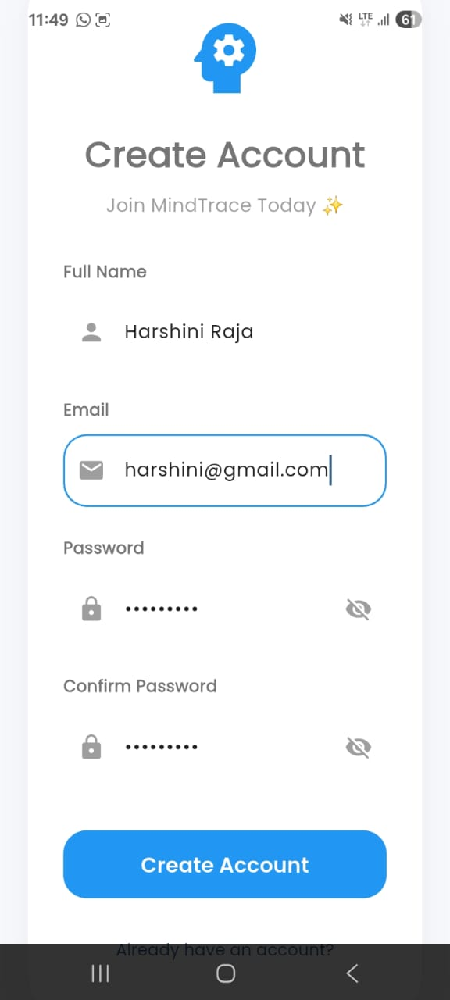
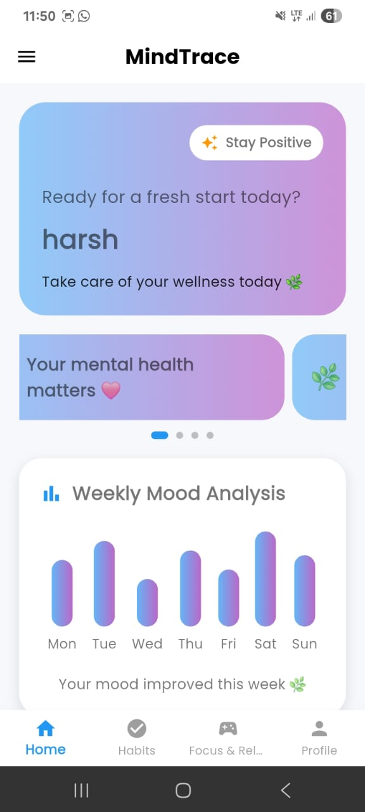
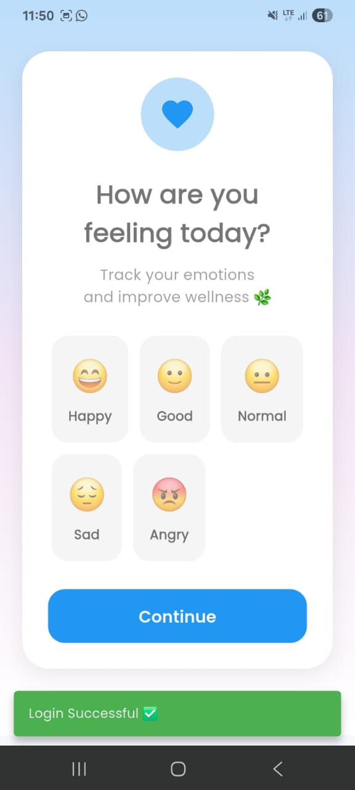
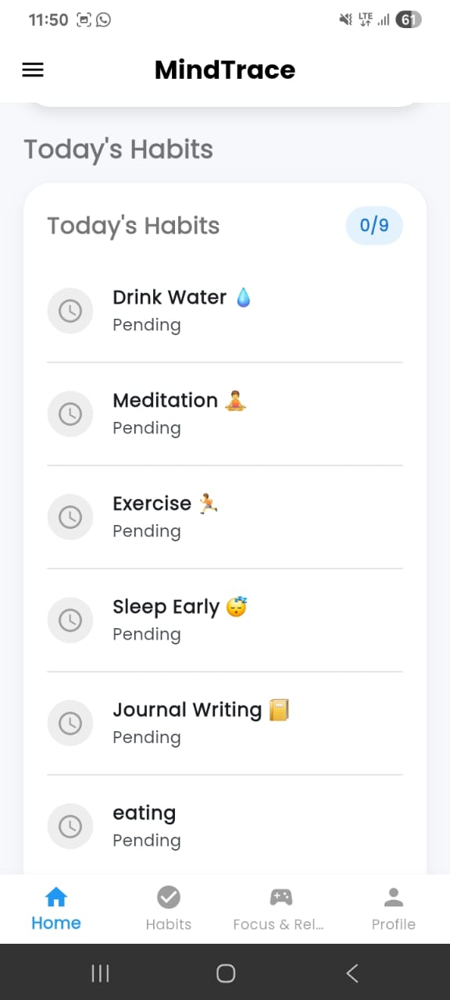
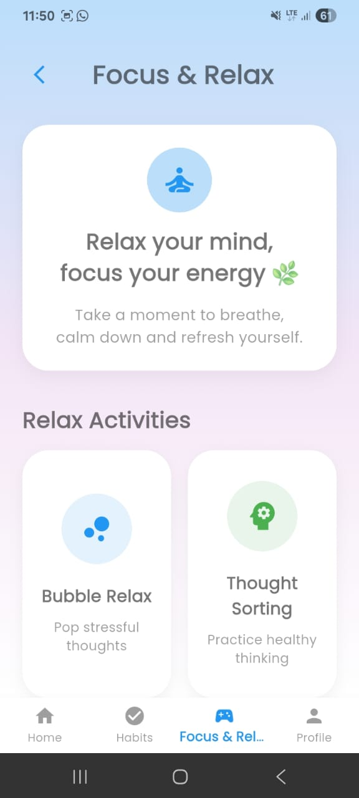
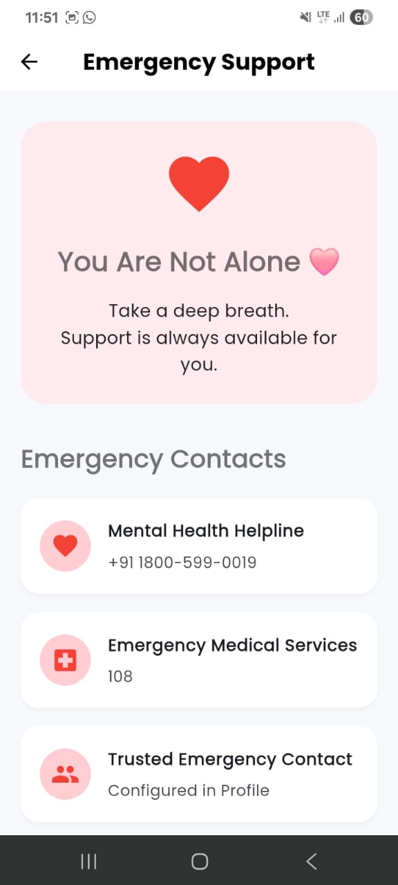

# MindTrace 🧠

### Digital Well-being & Mental Wellness Mobile Application

MindTrace is a Flutter-based mobile application designed to promote healthier digital habits and support personal well-being through simple and interactive features.

## 🚀 Features

- 📊 Screen Time Tracker
- 😊 Mood Tracking & Analysis
- 📔 Memory Journal
- 🧠 Mental Health Checkup
- 🎯 Focus Mode
- ✅ Habit Tracker
- 🧘 Meditation & Breathing Exercises
- 📝 Tasks & Reminders
- 🚨 Emergency Support

## 🛠️ Technologies Used

- Flutter
- Dart
- Firebase
- Android Studio
- Git & GitHub

## 📱 Application Modules

MindTrace brings multiple well-being features together in one mobile application, including mood tracking, journaling, habit management, focus activities, meditation, and support resources.

## 🎯 Project Objective

The goal of MindTrace is to encourage users to develop healthier digital habits, understand their moods, maintain positive routines, and take time for relaxation and self-reflection.

## 🔮 Future Enhancements

- Advanced mood analytics
- Personalized recommendations
- Improved habit insights
- Additional wellness activities
- Enhanced user experience

## 📸 Screenshots

### Login

### Home Dashboard

### Mood Tracker

### Habit Tracker

### focus

### emergencysupport

## 👩‍💻 Developer

**Sri Akshaya R**

B.Sc. Information Technology  
Lady Doak College
